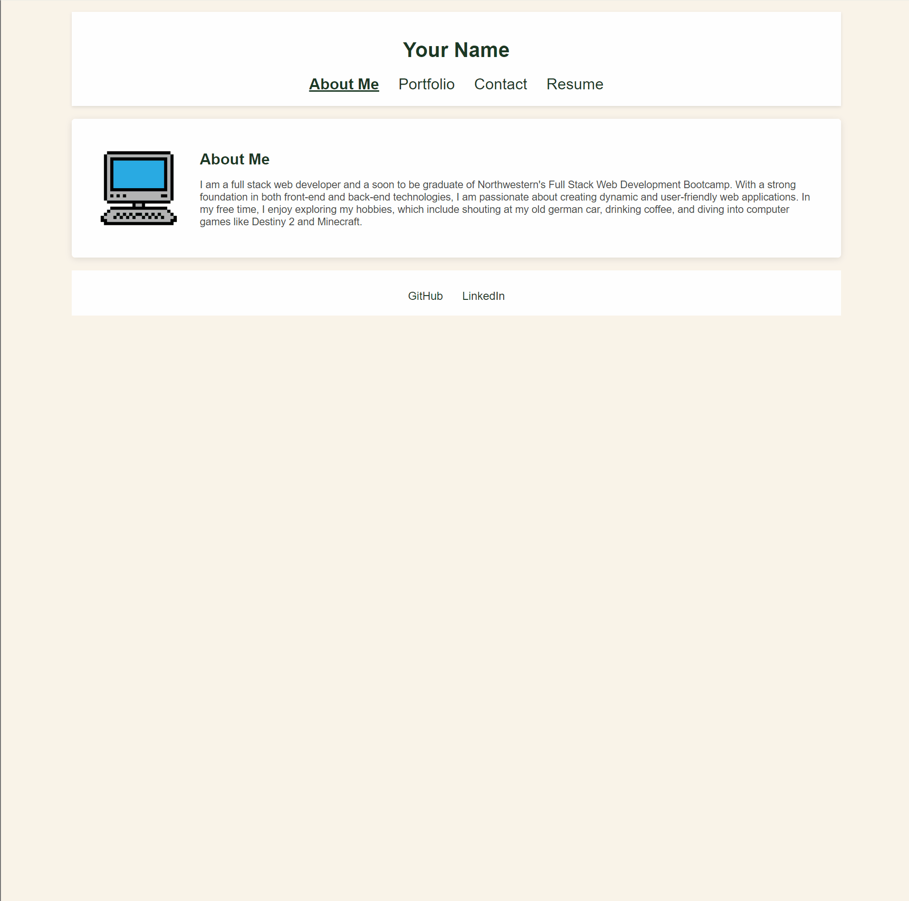

# My Portfolio

## Description

This project is a personal portfolio website designed to showcase my skills, projects, and contact information. 

- **What was your motivation?**  
  My motivation for creating this portfolio was to have a professional online presence that highlights my work and skills as a web developer.

- **Why did you build this project?**  
  I built this project to demonstrate my abilities in web development and to provide potential employers and clients with a comprehensive view of my work.

- **What problem does it solve?**  
  This portfolio serves as a centralized location for showcasing my projects and skills, making it easier for others to view my work and contact me for opportunities.

- **What did you learn?**  
  Throughout this project, I learned about responsive design, React.js, and how to deploy a web application using Netlify. I also gained experience in creating a user-friendly interface and managing state in React.

## Table of Contents

- [Installation](#installation)
- [Usage](#usage)
- [Credits](#credits)
- [License](#license)

## Installation

To install this project locally, follow these steps:

1. Clone the repository:
   ```bash
   git clone https://github.com/https://github.com/ogchromebook/main-portfolio
   ```
2. Navigate to the project directory:
   ```bash
   cd main-portfolio
   ```
3. Install the required dependencies:
   ```bash
   npm install
   ```
4. Start the development server:
   ```bash
   npm start
   ```

## Usage

Once the development server is running, you can view the portfolio in your browser at `http://localhost:3000`. The portfolio includes sections for projects, an about me section, a contact form, and a downloadable resume.

To add a screenshot, create an `assets/images` folder in your repository and upload your screenshot to it. Then, using the relative filepath, add it to your README using the following syntax:

**Portfolio Demo**




## Credits

- [Sam Kachergius](https://github.com/ogchromebook) - Developer
- [EmailJS](https://www.emailjs.com/) - For handling email submissions
- [React](https://reactjs.org/) - JavaScript library for building user interfaces

## License

This project is licensed under the MIT License. See the [LICENSE](LICENSE) file for details.

## Badges


## Features

- Responsive design
- Contact form with email submission
- Downloadable resume
- Project showcase

## How to Contribute

If you would like to contribute to this project, please fork the repository and submit a pull request. You can also open an issue for any suggestions or improvements.
